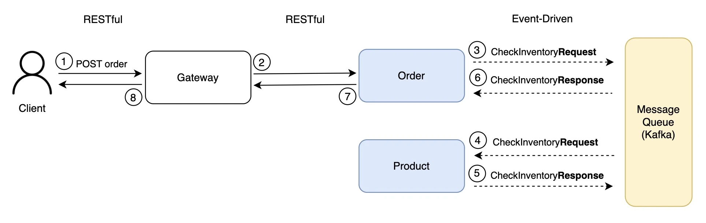
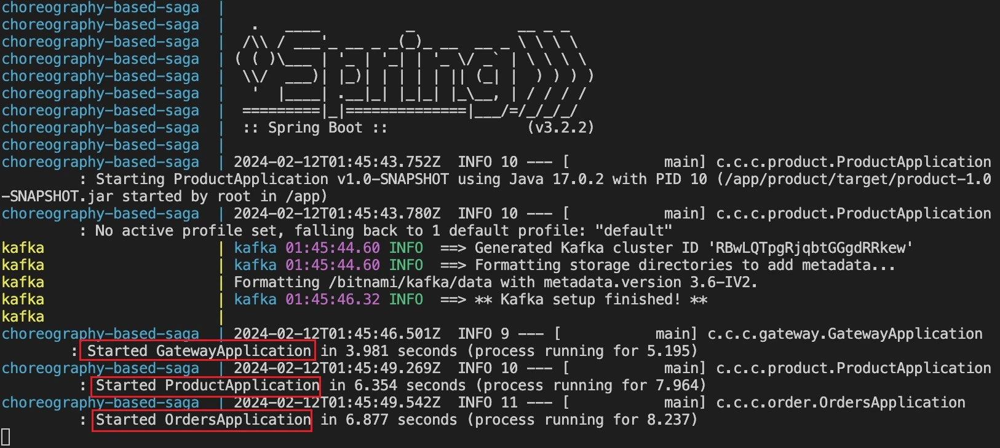
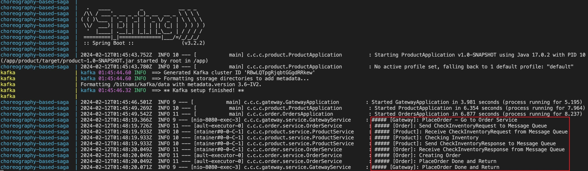
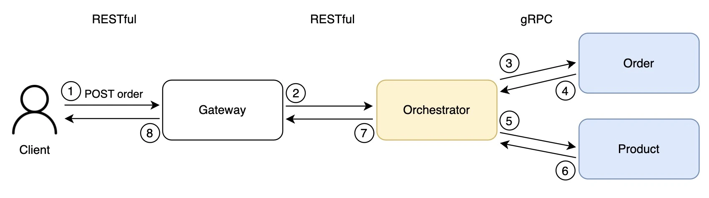
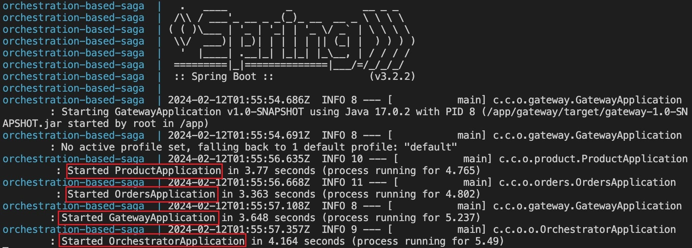
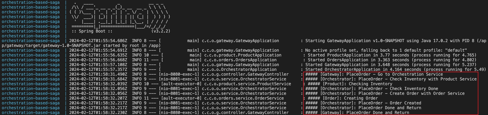

# Microservices Saga Demo
This repo is a demo to implement microservices architecture based on Saga.

The origin article is on Medium: [Transactional Patterns in Microservices Based on Saga](https://medium.com/p/d40f68cafbf0).

## Overview
- **Choreography-Based Saga**: Each service focuses on event publish and subscription, indirectly communicate with each other through message queue.
- **Orchestration-Based Saga**: Service dependency is managed by an orchestrator.

## Choreography-Based Saga
### Demo Overview
<p align="center">
  
  <br/>
  <b>Choreography-Based Demo Overview</b>
</p>

### Run
```shell
# Deploy container (Ctrl-C to exit)
docker compose -f docker-compose-choreography.yaml up
```

<p align="center">
  
  <br/>
  <b>Choreography-Based Saga: Services Ready</b>
</p>

### Send Request
```shell
# Send Request to Gateway
curl -XPOST 'http://localhost:8080/order' -d '{"userId": "user1", "productId": "DUMMY_PRODUCT", "quantity": 1, "totalPrice": 100}' -H "Content-Type: application/json"
```

### Result
```log
##### [Gateway]: PlaceOrder - Go to Order Service                   # Step 2
##### [Order]: Send CheckInventoryRequest to Message Queue          # Step 3
##### [Product]: Receive CheckInventoryRequest from Message Queue   # Step 4
##### [Product]: Checking Inventory
##### [Product]: Send CheckInventoryResponse to Message Queue       # Step 5
##### [Order]: Receive CheckInventoryResponse from Message Queue    # Step 6
##### [Order]: Creating Order
##### [Order]: PlaceOrder Done and Return                           # Step 7
##### [Gateway]: PlaceOrder Done and Return                         # Step 8
```

<p align="center">
  
  <br/>
  <b>Choreography-Based Saga: Result</b>
</p>


### Delete
```shell
# Delete all containers and relevant images
docker compose -f docker-compose-choreography.yaml down --rmi all
```

## Orchestration-Based Saga
### Demo Overview
<p align="center">
  
  <br/>
  <b>Orchestration-Based Demo Overview</b>
</p>

### Run

```shell
# Deploy container (Ctrl-C to exit)
docker compose -f docker-compose-orchestration.yaml up
```

<p align="center">
  
  <br/>
  <b>Orchestration-Based Saga: Services Ready</b>
</p>

### Send Request
```shell
# Send Request to Gateway
curl -XPOST 'http://localhost:8080/order' -d '{"userId": "user1", "productId": "DUMMY_PRODUCT", "quantity": 1, "totalPrice": 100}' -H "Content-Type: application/json"
```

### Result
```log
##### [Gateway]: PlaceOrder - Go to Orchestration Service                 # Step 2
##### [Orchestrator]: PlaceOrder - Check Inventory with Product Service   # Step 3
##### [Product]: Checking Inventory
##### [Orchestrator]: PlaceOrder - Check Inventory Done                   # Step 4
##### [Orchestrator]: PlaceOrder - Create Order with Order Service        # Step 5
##### [Order]: Creating Order
##### [Orchestrator]: PlaceOrder - Order Created                          # Step 6
##### [Orchestrator]: PlaceOrder Done and Return                          # Step 7
##### [Gateway]: PlaceOrder Done and Return                               # Step 8
```

<p align="center">
  
  <br/>
  <b>Orchestration-Based Saga: Result</b>
</p>

### Delete
```shell
# Delete all containers and relevant images
docker compose -f docker-compose-orchestration.yaml down --rmi all
```
